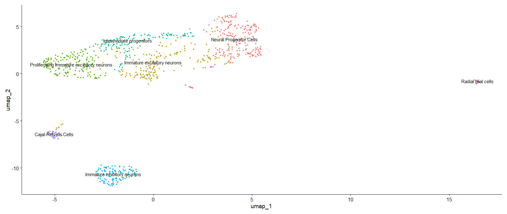

# scRNA-Seq Analysis of Mouse Brain Cells Using Seurat
This analysis was carried out on E18 mouse brain to explore cellular heterogenity during development. The analysis was carried out using Seurat package and distinct cell populations and biomakers were identified known to be involved in neuronal development. 

## Objective 

1. Identify cell-type specific biomarkers in E18 mouse brain tissue.
2. Characterize neural cellular heterogenity during developmental stages.


## Dataset
Dataset is from 10x genomics platform. The cells from hippocampus, cortex and sub-ventricular zone (SVZ) were sequenced on Illumina HiSeq2500 platform and analyzed using Cell Ranger 2.1.0. 
The data can be found [here](https://www.10xgenomics.com/datasets/1-k-brain-cells-from-an-e-18-mouse-2-standard-2-1-0)

## Data Analysis

Data analysis was performed using Seurat. Matrix files and cell barcodes were downloaded from 10x genomics platform and loaded into RStudio. 
Following analysis steps were done:

1. Loading the data and creating Seurat object
2. Initial QC to filter out cells with low quality, mitochondrial genes & doublets/multiplets
3. Normalization to account for technical replicates
4. Identification of highly variable genes to focus on biologically relevant data
5. Scaling the data to remove unwanted sources of variation
6. Linear dimenionality reduction using PCA
7. Non-linear dimensionality reduction using UMAP & t-SNE
8. Clustering the cells to understand cellular heterogenity within mouse brain
9. Annotating cell clusters based on expressed markers from [CellMarker2.0](http://www.bio-bigdata.center/) & [Panglaodb](https://panglaodb.se/)

## Results

Cell clustering at 0.5 resolution identified 7 clusters of progenitor neurons (both inhibitory & excitatory), intermediate neurons, neural progenitor cells, radial glial cells and cajal-retzius cells. 
These clusters expressed markers of proliferation and development such as Mcmbp, Sox2, Reln, Tubb3,Vim etc. 
This reveled that dataset consisted of immature proliferating neurons. 

 

## Repository Files
```
scRNA_seq_Analysis_Mouse_Brain/
├── Annotated_Cell_Clusters.png                    # Plot showing annotated cell clusters
├── Cell Markers Associations.txt            # Text file describing markers associations 
├── Cluster_Markers.png                      # Violin plots showing expression of markers 
├── Clusters(0.5res).png                      # Total clusters observed at 0.5 resolution
├── cluster_markers.csv                      # a csv file of markers expressed in each cluster
├── Mouse_Brain.Rproj          # RStudio project file
└── README.md                  # Project documentation
```

